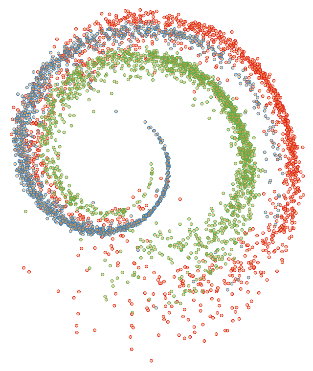
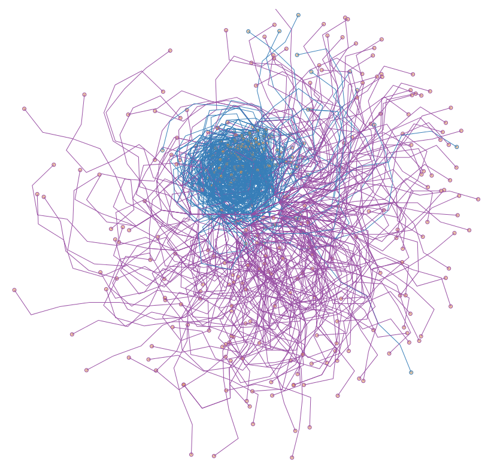

This is a proof of concept for high dimensional data visualization.
Each data point starts at the center of the screen and shifts outwards in angles 
that are based on the values of each feature. The data point moves as many times
as features there are.

The project was built using Typescript and Reactjs. To deploy it, go to the project root folder and run:

```
npm start
```

Example of the [abalone](http://archive.ics.uci.edu/ml/datasets/Abalone) dataset.



And [breast cancer](http://archive.ics.uci.edu/ml/datasets/Breast+Cancer+Wisconsin+%28Diagnostic%29)


